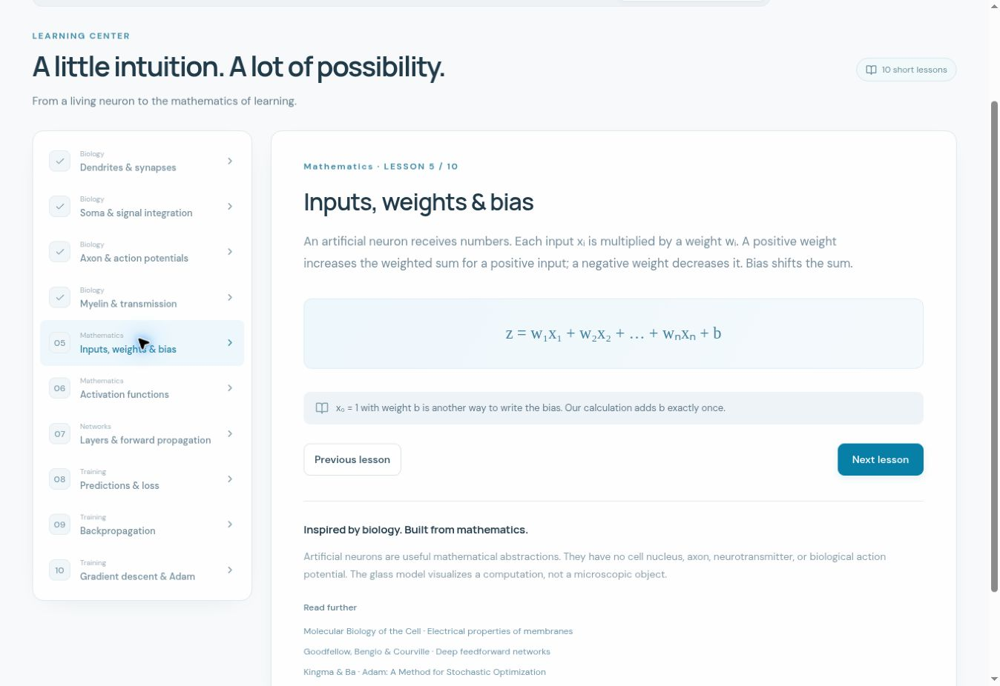

# AI Playground

**An interactive 3D neural network laboratory by Amir Saeid Dehghan.**

Explore a biological neuron beside a blue glass artificial neuron, change real computations, build a dense network, and train it in your browser. No account, backend, API key, paid service, or downloaded AI model is needed.

**Live site:** https://saaeiddev.github.io/AI-Playground-/

The existing repository is named `AI-Playground-`, with a trailing hyphen. Its GitHub Pages path therefore includes that hyphen. This implementation replaces the previous standalone `app.mjs`, `neural.mjs`, and `styles.css` version.

## Workspaces

| Workspace             | What you can do                                                                                                                                                                           |
| --------------------- | ----------------------------------------------------------------------------------------------------------------------------------------------------------------------------------------- |
| Neuron Explorer       | Orbit and zoom a biological neuron and a refractive glass mathematical neuron. Inspect biological parts and change the illustrative membrane potential.                                   |
| Artificial Neuron Lab | Add/remove 1–6 inputs, edit inputs, weights and bias, select six activations, inspect every multiplication, and follow six computational stages.                                          |
| Network Builder       | Create a dense feedforward network with 0–4 hidden layers, 1–8 neurons per layer, multiple inputs/outputs, and editable parameters.                                                       |
| Training Studio       | Train on AND, OR, XOR, Linear, Circle and Spiral datasets. Observe genuine loss, training accuracy, parameter values, sample predictions and a decision surface. Pause, resume and reset. |
| Learning Center       | Ten concise lessons covering biological signaling, mathematical neurons, forward propagation, loss, gradients, backpropagation and Adam.                                                  |

The artificial neurons use actual Three.js sphere geometry, physical transmission, a studio environment, refractive thickness, clearcoat, cyan rims, a curved internal partition and billboarded Σ / ƒ symbols. The biological model is original procedural geometry, not a third-party stock asset. **Explore the biology** opens the Learning Center with that interactive model embedded in all four biology lessons, alongside anatomy selection, signal controls and the illustrative membrane-potential control.



Actual screenshot of the published Learning Center. Hardware-rendered 3D screenshots could not be captured in the validation browser; see the [validation record](docs/VALIDATION.md).

## Development

Requires **Node.js 22+** and npm.

```bash
git clone https://github.com/saaeiddev/AI-Playground-.git
cd AI-Playground-
npm ci
npm run dev
```

Open the URL reported by Vite, normally `http://localhost:4173/`.

```bash
npm test          # automated computation and scene-structure tests
npm run build     # strict TypeScript checks + production build
npm run preview   # serve the production output
```

`dist/` is the complete static production site. A server must serve it over HTTP(S); opening `index.html` as a `file:` URL is unsupported because module workers require an HTTP origin.

## GitHub Pages

The included `.github/workflows/pages.yml` runs on a push to `main` or a manual dispatch. It installs the exact lockfile, runs all tests, builds the production app, uploads **only `dist/`**, and deploys to the `github-pages` environment.

For initial setup, choose **Settings → Pages → Source → GitHub Actions**. The workflow also requests automatic Pages enablement where GitHub permits it. The workflow needs `contents: read`, `pages: write`, and `id-token: write`.

Vite uses `base: './'`. Script, stylesheet, local font, lazy-chunk and worker URLs remain relative to the deployed repository path. Hash navigation keeps all five workspaces compatible with static GitHub Pages hosting; it needs no server rewrite rules. A future repository rename does not require rebuilding hard-coded asset prefixes, but update the displayed site/repository links in the README and footer.

## Mathematical model

For one neuron:

```text
contributionᵢ = wᵢ × xᵢ
z = Σᵢ contributionᵢ + b
y = f(z)
```

The visual `x₀ = 1` connection has weight `b`. **Bias is added exactly once.** Values in the equation, contributions table, output display and connection animations come from the same calculation.

| Activation | Definition                                                           |
| ---------- | -------------------------------------------------------------------- |
| Sigmoid    | `1 / (1 + exp(-z))`, computed with a stable positive/negative branch |
| ReLU       | `max(0, z)`                                                          |
| Leaky ReLU | `z` for `z ≥ 0`, otherwise `0.01 z`                                  |
| Tanh       | `tanh(z)`                                                            |
| Linear     | `z`                                                                  |
| Step       | `1` for `z ≥ 0`, otherwise `0`                                       |

A dense layer computes `a[l] = f(W[l] a[l-1] + b[l])`. Arrays are stored as `weights[layer][destination][source]`. The inspector displays the actual incoming activation values, weights, bias, preactivation and output for the selected probe.

## Training engine

The engine is intentionally small, dependency-free TypeScript, rather than an opaque inference service:

- Deterministic seeded Xavier-uniform parameter initialization.
- A genuine dense multilayer perceptron with analytic chain-rule backpropagation.
- Full-batch Adam, with β₁ = 0.9, β₂ = 0.999, ε = 1e−8 and bias correction.
- Sigmoid classification outputs; the selected activation applies to hidden layers.
- Binary cross-entropy computed directly from logits: `max(z,0) - z*t + log1p(exp(-abs(z)))`, averaged over samples and output units.
- Output-layer logit derivative `(prediction - target) / (sampleCount * outputCount)`.
- A dedicated ES-module Web Worker, bounded compute chunks, and periodic genuine model snapshots.
- Pause acknowledgement and revision identifiers discard obsolete worker messages. Resume retains parameters and Adam moments. Reset reinitializes parameters and optimizer. Manual weight edits begin a new training history.
- A 20,000-epoch guard prevents an unattended experiment from running indefinitely.

Step activation is available in the simulator/builder but excluded from gradient-based training because it is non-differentiable at zero and has zero derivative elsewhere. A linear hidden activation cannot solve nonlinear problems such as XOR merely by adding more linear layers.

All metrics and decision-surface values are evaluated from the current model. Reported accuracy is **training accuracy**, not held-out generalization performance. No loss trajectory, prediction or training result is hard-coded.

## Visual conventions and controls

- Drag with one pointer to orbit; scroll or pinch to zoom.
- Right-drag, or two-finger touch interaction, pans via Three.js OrbitControls.
- Camera buttons zoom, fit the current graph and restore the initial view.
- Click a glass neuron or connection to select its destination inspector. The inspector's neuron selector provides a keyboard alternative.
- Cyan connections indicate positive weights; violet indicates negative weights. Brightness varies with weight magnitude. Particle size/speed reflects the absolute weighted contribution; zero contributions have no moving particle.
- The single-neuron stepper follows input, multiplication, summation, bias, activation and output stages.
- During training, the 3D network shows the **selected probe's forward pass** using the latest model parameters. It is an explanatory animation, not a frame-accurate record of every batch operation.
- Click the decision surface or edit the two probe inputs to inspect a prediction.
- Use Reduced motion to disable signal animations. The initial setting follows the operating-system preference.
- Experiments are local and ephemeral; refreshing the page resets them. The training workspace stops its worker when leaving that workspace.

## Biology and scientific limits

The procedural multipolar neuron includes dendrites, soma, nucleus, axon hillock, axon, myelin, nodes of Ranvier, terminal branches and synaptic junctions. Incoming lights illustrate graded inputs. Axonal propagation and terminal release are shown only when the illustrative threshold is reached.

Signals **do not travel through the nucleus**. Action potentials commonly initiate at the axon initial segment near the hillock. Myelin supports saltatory conduction, with regeneration at nodes. At chemical synapses, calcium entry triggers neurotransmitter release. The model simplifies cell anatomy, ion dynamics and timing; −55 mV is illustrative and not a universal threshold. It is not a Hodgkin–Huxley electrophysiology simulator.

Artificial neurons are mathematical abstractions. They contain no biological organelles and do not generate biological action potentials. The glass body and luminous paths make numerical operations visible.

## Architecture and project structure

React manages forms and application state. Three.js directly owns each canvas; this avoids coupling a training snapshot to reconstructing every 3D mesh. A bounded graph is retained until its architecture changes. Geometry, materials, textures, observers, controls and WebGL contexts are cleaned up on unmount.

| Path                            | Purpose                                                                |
| ------------------------------- | ---------------------------------------------------------------------- |
| `src/App.tsx`                   | Navigation, explorer, single-neuron lab and builder                    |
| `src/engine/neural.ts`          | Activations, forward pass, BCE, gradients and Adam                     |
| `src/engine/datasets.ts`        | Seeded educational datasets                                            |
| `src/engine/training.worker.ts` | Background training and pause/reset protocol                           |
| `src/graphics/NeuralScene.ts`   | Biological geometry, glass neurons, connections, picking and animation |
| `src/components/Scene.tsx`      | Canvas lifecycle, loading/failure UI and camera controls               |
| `src/components/Training.tsx`   | Training controls, model snapshots and metrics                         |
| `src/components/Inspector.tsx`  | Accessible neuron and connection inspector                             |
| `src/components/Charts.tsx`     | Genuine loss chart and decision surface                                |
| `src/components/Learning.tsx`   | Educational lessons and references                                     |
| `src/style.css`                 | Responsive design system                                               |
| `docs/VALIDATION.md`            | Validation evidence and known testing limits                           |
| `.github/workflows/pages.yml`   | Test, build and Pages publication                                      |

Fonts are bundled locally. The core application makes no third-party runtime requests. The Learn-more and GitHub links navigate to external sources only when selected.

The display pixel ratio is capped at 1.3 on narrow screens and 1.65 on larger screens. Offscreen/hidden renderers skip drawing. The training engine runs off the main thread. WebGL 2 is required for the actual 3D view; if graphics initialization fails, an explicit retry panel appears and the numerical simulator, training and lessons remain usable. Performance depends on the device and chosen network size; a universal 60 FPS claim is not made.

## Tests

The automated suite covers weighted summation, bias, every activation, invalid inputs, deterministic initialization, multilayer and multi-output propagation, all analytic gradients versus central finite differences, stable BCE for extreme logits, parameter editing, optimizer resume/reset semantics, every dataset and real loss reduction on all six training examples.

GPU-independent scene tests instantiate all three scene types with a mocked renderer while using real Three.js geometry and math. They validate finite geometry, required anatomical parts, architecture changes, graph connectivity, selection highlighting, cleanup and synchronization between actual network values and visual contributions. These tests **do not replace hardware-rendered visual QA**.

## Dependencies and attribution

| Dependency                                             | License     | Use                                            |
| ------------------------------------------------------ | ----------- | ---------------------------------------------- |
| React / React DOM                                      | MIT         | UI and application state                       |
| Three.js (including OrbitControls and RoomEnvironment) | MIT         | WebGL rendering and camera/environment helpers |
| Lucide React                                           | ISC         | Interface icons                                |
| DM Sans / Manrope, via Fontsource Variable             | SIL OFL 1.1 | Locally served typefaces                       |
| Vite / plugin-react                                    | MIT         | Development and production bundling            |
| TypeScript                                             | Apache 2.0  | Static type checking                           |
| Vitest                                                 | MIT         | Automated tests                                |
| React/Three.js TypeScript declaration packages         | MIT         | Development types                              |

Exact versions and transitive dependencies are pinned in `package-lock.json`. License notices for distributed runtime dependencies and fonts are included in `public/licenses/` and copied to the build. All neuron meshes and scientific diagrams are generated specifically for this application. No external 3D model or reference photograph is redistributed.

## References

- [Three.js physical transmission materials](https://threejs.org/docs/pages/MeshPhysicalMaterial.html)
- [Goodfellow, Bengio & Courville — Deep Feedforward Networks](https://www.deeplearningbook.org/contents/mlp.html)
- [Kingma & Ba — Adam: A Method for Stochastic Optimization](https://arxiv.org/abs/1412.6980)
- [PyTorch — numerically stable BCE with logits](https://docs.pytorch.org/docs/stable/generated/torch.nn.BCEWithLogitsLoss.html)
- [Molecular Biology of the Cell — electrical properties of membranes](https://www.ncbi.nlm.nih.gov/books/NBK26910/)
- [GitHub — custom Pages workflows](https://docs.github.com/en/pages/getting-started-with-github-pages/using-custom-workflows-with-github-pages)

**Created By Amir Saeid Dehghan**
